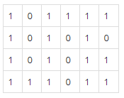

# Breadth-First Search (너비 우선 탐색)

<br>

## 개념

> 그래프를 탐색할 때 루트 노드 또는 임의 노드에서 **인접한 노드부터 먼저 탐색**하는 방법 (Node (Vertex) : 정점, Edge : 정점 사이를 이은 간선)

**Que**를 통해 구현한다. (해당 노드의 주변부터 탐색해야하기 때문)

1. 출발점을 Enqueue한다.
2. Que에 저장된 정점을 하나 Dequeue한다.
3. Dequeue된 정점과 연결된 모든 정점을 Enqueue한다.
4. 2 ~ 3의 과정을 반복하고 Que가 비어있다면 반복을 종료한다.

<br>

- 최소 비용(즉, 모든 곳을 탐색하는 것보다 최소 비용이 우선일 때)에 적합


##### 시간 복잡도

- 인접 행렬 : O(V^2)
- 인접 리스트 : O(V+E)

##### Code

```java
import java.util.*;
public class BFS {
	private static void bfs(int start, int[][] graph, boolean[] visited) {
		Queue<Integer> que = new LinkedList<Integer>();
		que.offer(start);
		visited[start] = true;
//		시작점을 que에 enqueue하고 방문 체크

		while (!que.isEmpty()) {
//		queue가 완전히 비어질 때까지 반복
			int idx = que.poll();
//			노드 하나를 dequeue하고 저장

			System.out.println("빼냄 : " + idx + " ");
			System.out.print("넣음 : ");

			for (int i = 0; i < graph[idx].length; i++) {
//			dequeue한 노드와 연결된 노드에 대해서 조사
				if (!visited[graph[idx][i]]) {
//				만약 dequeue한 노드와 연결된 노드가 방문되지 않았던 곳이라면 enqueue하고 방문 체크
					que.offer(graph[idx][i]);
					visited[graph[idx][i]] = true;

					System.out.print(graph[idx][i] + " ");
				}
			}
			System.out.println("");
		}
		System.out.println("");
	}

	public static void main(String[] args) {
		int[][] graph = new int[][]
									{
									{},
									{2, 3, 4},
									{1, 5},
									{1, 6, 7},
									{1, 8},
									{2, 9},
									{3, 10},
									{},
									{4},
									{5},
									{6}
									};
		boolean[] visited = new boolean[graph.length];
		bfs(1, graph, visited);
	}
}
```

<br>

## 부록 (최단거리 구하기)



#### Code

```java
import java.util.*;
public class BFS {
	private static int[] dr = new int[] {0, -1, 0, 1};
	private static int[] dc = new int[] {1, 0, -1, 0};
//	극좌표 방향과 동일하게 delta row와 delta col 선언

	private static void bfs(int[] start, int[] end, int[][] graph, boolean[][] visited) {
		Queue<int[]> que = new LinkedList<>();
		que.add(start);

		while (!que.isEmpty()) {
			int[] now = que.poll();
//			노드 하나를 dequeue하고 저장

			for (int i = 0; i < 4; i++) {
//			상하좌우로 이동가능하기 때문에 빼낸 노드를 기준으로 4번 조사
				int nextR = now[0] + dr[i];
				int nextC = now[1] + dc[i];

				if (nextR >= 0 && nextR < graph.length &&
					nextC >= 0 && nextC < graph[0].length) {
//				dr, dc가 더해진 노드가 전체 범위를 벗어나지 않는지 확인 (인덱스 초과 예외 방지용)
					if (!visited[nextR][nextC] && graph[nextR][nextC] == 1) {
						que.add(new int[] {nextR, nextC});
//						더해진 노드가 방문된 적 없고 갈 수 있는 곳이라면 enqueue
						visited[nextR][nextC] = true;
//						방문 체크
						graph[nextR][nextC] = graph[now[0]][now[1]] + 1;
//						이전 노드에 쌓인 거리에 1을 더한 값을 다음 노드에 저장
					}
				}
			}
		}

		System.out.println(graph[end[0]][end[1]]);
	}

	public static void main(String[] args) {
		int[][] graph = new int[][]
									{
									{1, 0, 1, 1, 1, 1},
									{1, 0, 1, 0, 1, 0},
									{1, 0, 1, 0, 1, 1},
									{1, 1, 1, 0, 1, 1},
									};
		boolean[][] visited = new boolean[graph.length][graph[0].length];
		int[] start = new int[] {0, 0};
		int[] end = new int[] {graph.length - 1, graph[1].length - 1};
//		시작 좌표의 row와 col
		bfs(start, end, graph, visited);
	}
}
```

<br>

**연습문제** :
<br>
[[BOJ] DFS와 BFS](https://www.acmicpc.net/problem/1260)
<br>
[[BOJ] 바이러스](https://www.acmicpc.net/problem/2606)
<br>
[[BOJ] 단지번호붙이기](https://www.acmicpc.net/problem/2667)
<br>
[[BOJ] 토마도](https://www.acmicpc.net/problem/7569)
<br>

##### [참고 자료]

- [링크](https://developer-mac.tistory.com/64)
