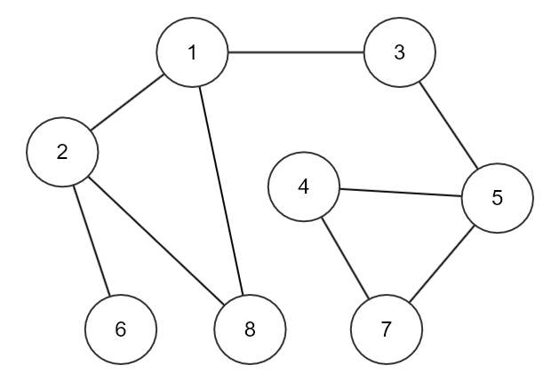

# Depth-First Search (깊이 우선 탐색)

그래프 알고리즘으로, 문제를 풀 때 상당히 많이 사용한다.

경로를 찾는 문제 시, 상황에 맞게 DFS와 BFS를 활용하게 된다.

<br>

## 개념

> 루트 노드 혹은 임의 노드에서 **다음 브랜치로 넘어가기 전에, 해당 브랜치를 모두 탐색**하는 방법

**스택 or 재귀함수**를 통해 구현한다.

## 특징

- 자기 자신을 호출하는 순환 알고리즘의 형태를 가지고 있다.
- 전위 순회(Pre-Order Traversals)를 포함한 다른 형태의 트리 순회는 모두 DFS의 한 종류이다
    - 전위 순회는 뿌리 > 왼쪽 자식 > 오른쪽 자식 순으로 진행
- 이 알고리즘을 구현할 때 가장 큰 차이점은, 그래프 탐색의 경우 어떤 노드를 방분했었는지 여부를 반드시 검사 해야 한다는 것이다.
- 이를 검사하지 않을 경우 무한루프에 빠질 위험이 있다.

<br>

## 과정

1. a 노드(시작 노드)를 방문한다.
    - 방문한 노드는 방문했다고 표시한다.
2. a와 인접한 노드들을 차례로 순회한다.
    - a와 인접한 노드가 없다면 종료한다.
3. a와 이웃한 노드 b를 방문했다면, a와 인접한 또 다른 노드를 방문하기 전에 b의 이웃 노드들을 전부 방문해야 한다.
    - b를 시작 정점으로 DFS를 다시 시작하여 b의 이웃 노드들을 방문한다.
4. b의 분기를 전부 완벽하게 탐색했다면 다시 a에 인접한 정점들 중에서 아직 방문이 안 된 정점을 찾는다.
    - 즉, b의 분기를 전부 완벽하게 탐색한 뒤에야 a의 다른 이웃 노드를 방문할 수 있다는 뜻이다.
    - 아직 방문이 안 된 정점이 없으면 종료한다.
    - 있으면 다시 그 정점을 시작 정점으로 DFS를 시작한다.

<br>

- 모든 노드를 방문하는 경우에 적합


### 시간 복잡도

- 인접 행렬 : O(V^2)
- 인접 리스트 : O(V+E)

> V는 접점, E는 간선을 뜻한다

### 재귀로 구현한 코드
##### 그래프 예시


<br>

```java
/* 재귀 형태로 구현 */
public class DFS {

	// 방문처리에 사용 할 배열선언
	static boolean[] vistied = new boolean[9];
	
	// 그림예시 그래프의 연결상태를 2차원 배열로 표현
	// 인덱스가 각각의 노드번호가 될 수 있게 0번인덱스는 아무것도 없는 상태라고 생각하시면됩니다.
	static int[][] graph = {{}, {2,3,8}, {1,6,8}, {1,5}, {5,7}, {3,4,7}, {2}, {4,5}, {1,2}};
	
	public static void main(String[] args) {
		dfs(1);
	}
	
	static void dfs(int nodeIndex) {
		// 방문 처리
		vistied[nodeIndex] = true;
		
		// 방문 노드 출력
		System.out.print(nodeIndex + " -> ");
		
		// 방문한 노드에 인접한 노드 찾기
		for (int node : graph[nodeIndex]) {
			// 인접한 노드가 방문한 적이 없다면 DFS 수행
			if(!vistied[node]) {
				dfs(node);
			}
		}
	}
}

```
<br>

### 스택으로 구현한 코드
```java
/* 스택으로 구현 */
public class DFS {

	// 방문처리에 사용 할 배열선언
	static boolean[] vistied = new boolean[9];
	
	// 그림예시 그래프의 연결상태를 2차원 배열로 표현
	// 인덱스가 각각의 노드번호가 될 수 있게 0번인덱스는 아무것도 없는 상태라고 생각하시면됩니다.
	static int[][] graph = {{}, {2,3,8}, {1,6,8}, {1,5}, {5,7}, {3,4,7}, {2}, {4,5}, {1,2}};
	
	// DFS 사용 할 스택
	static Stack<Integer> stack = new Stack<>();
	
	public static void main(String[] args) {
		
		// 시작 노드를 스택에 넣어줍니다.
		stack.push(1);
		// 시작 노드 방문처리
		vistied[1] = true;
		
		// 스택이 비어있지 않으면 계속 반복
		while(!stack.isEmpty()) {
			
			// 스택에서 하나를 꺼냅니다.
			int nodeIndex = stack.pop();
			
			// 방문 노드 출력
			System.out.print(nodeIndex + " -> ");
			
			// 꺼낸 노드와 인접한 노드 찾기
			for (int LinkedNode : graph[nodeIndex]) {
				// 인접한 노드를 방문하지 않았을 경우에 스택에 넣고 방문처리 
				if(!vistied[LinkedNode]) {
					stack.push(LinkedNode);
					vistied[LinkedNode] = true;
				}
			}
		}
	}
}
```
## 장점

- 구현이 너비 우선 탐색(BFS) 보다 간단하다
- 현재 경로상의 노드들만 기억하면 되므로, 저장 공간의 수요가 비교적 적음
- 목표 노드가 깊은 단계에 있는 경우 해를 빨리 구할 수 있음

<br>

## 단점

- 단순 검색 속도는 너비 우선 탐색(BFS) 보다 느리다
- 해가 없는 경로가 깊을 경우 탐색시간이 오래 걸릴 수 있다.
- 얻어진 해가 최단 경로가 된다는 보장이 없다.
- 깊이가 무한히 깊어지면 스택오버플로우가 날 위험이 있다. 
  - (깊이 제한을 두는 방법으로 해결가능)


<br>

**연습문제** :
<br>
[[BOJ] DFS와 BFS](https://www.acmicpc.net/problem/1260)
<br>
[[BOJ] 연결 요소](https://www.acmicpc.net/problem/11724)
<br>
[[BOJ] 이분 그래프](https://www.acmicpc.net/problem/1707)
<br>
[[BOJ] 섬의 개수](https://www.acmicpc.net/problem/4963)
<br>
[[BOJ] 단지번호붙이기](https://www.acmicpc.net/problem/2667)

##### [참고 자료]

- [https://developer-mac.tistory.com/64](https://developer-mac.tistory.com/64)
- [https://gyoogle.dev/blog/algorithm/DFS%20&%20BFS.html](https://gyoogle.dev/blog/algorithm/DFS%20&%20BFS.html)
